# InfoCinemas2020_E17015_Anthoulis_Panagiotis

### Installation
<ol>
  <li>Open up Terminal and run the following commands:<ul><li> git clone https://github.com/PanagiotisAnthoulis/InfoCinemas2020_E17015_Anthoulis_Panagiotis.git</li>
  <li>
  (sudo) docker-compose up
  </li>
</ul>
  </li>
  <li>Open up your web browser and type in the search bar: "localhost:8787"</li>
</ol>
  <h4>Default Admin</h4>
  
| Name  | E-mail | Password     |
| ------------- | ------------- |---|
| admin  | admin@mail.com  | admin |

<h4>Mongodb Data</h4>
<ul>
  <li><h5>Single Users:{"name":user_name,"password":user_password,"mail":user_mail,"movies_seen":[],"admin":"no"}</h5></li>
  <li><h5>Admin Users:{"name":user_name,"password":user_password,"mail":user_mail,"admin":"yes"}</h5></li>
  <li><h5>Movies:{"title":movie_title,"release_date":movie_release,"desc":movie_description, "
    screenings":["screening":["sits_left":*int*,"screening_date":*date*],"screening"::["sits_left"...]]}</h5></li>
  </ul>
<h3> Functions per page</h3>
<ul>
  <li>
     <h3>Home page</h3>
      Functions: Sign up,Log in
      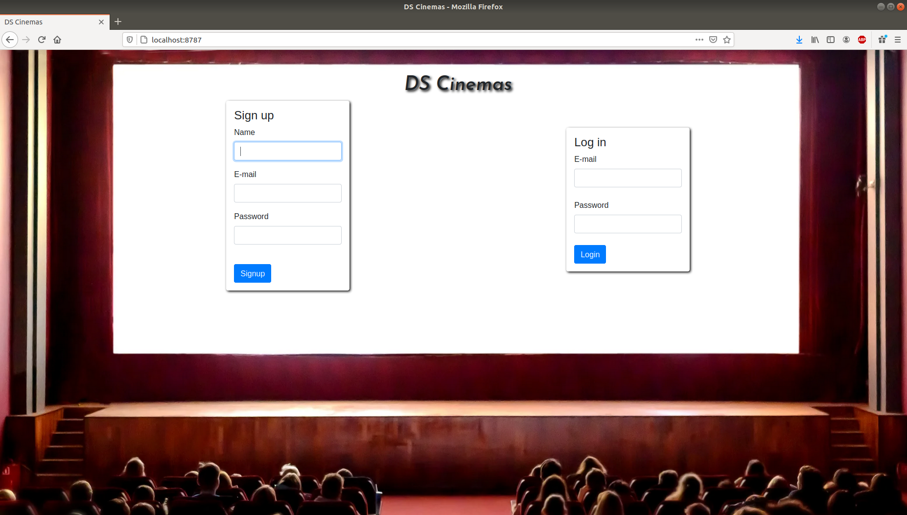</img> 
      <h4>User Sign up</h4>
      <h5>User/Admin inserts Name,E-mail,Password to Sign up.</h5>
      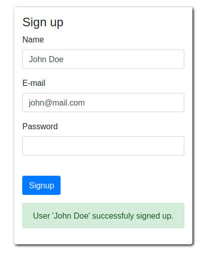</img>
      <h4>User Sign up (In case there is already a user with this e-mail)</h4>
      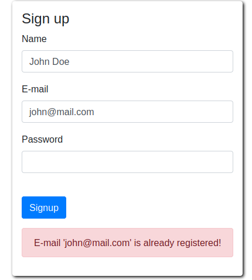</img>
      <h4>User/Admin Log in</h4>
      <h5>User/Admin inserts their credentials to log in the system.</h5>
      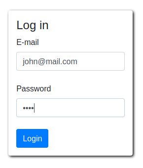</img>    
      <h4>User/Admin Log in (In case of wrong credentials).</h4>
      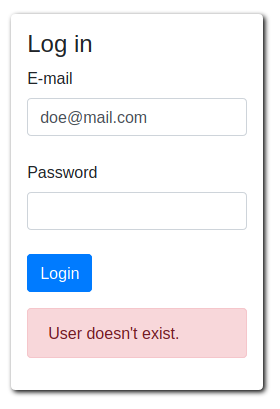</img> 
    </li>
    <li>
      <h3>User Home page</h3>
      <h4>Functions: Movie search,Book tickets</h4>
      </img>
      <h4>Movie search</h4>
      <h5>User types in the movie title they wish to book tickets for.</h5>
      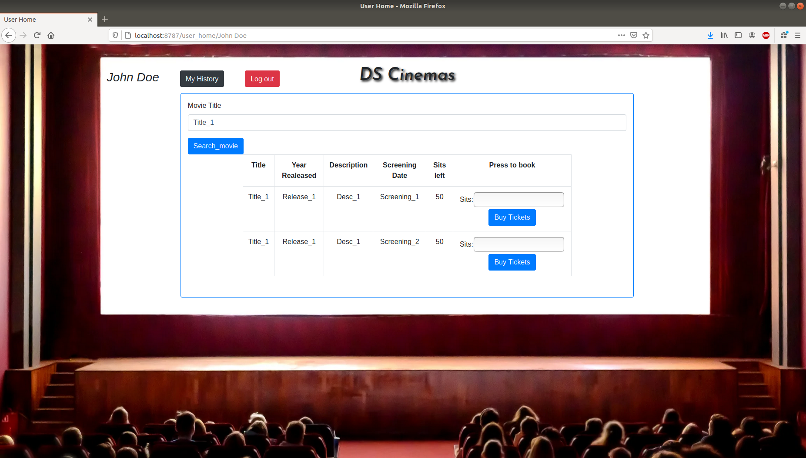</img>
      <h4>Ticket Book</h4>
      <h5>User types in amount of tickets they wish to book.
      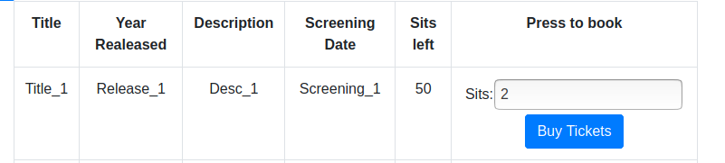</img>
      <h4>Submit Order</h4>
      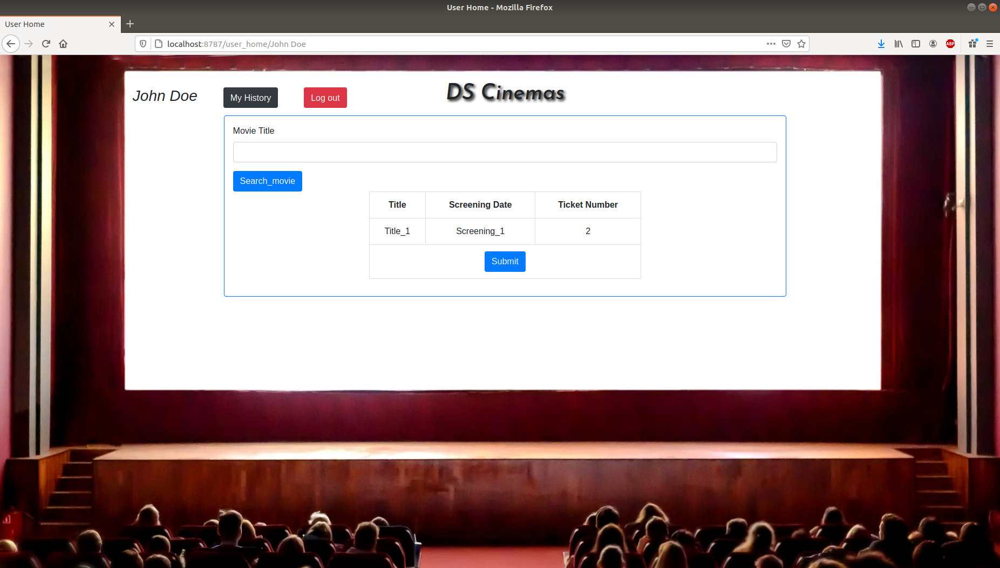</img>
      <h4>Book Succesful</h4>
      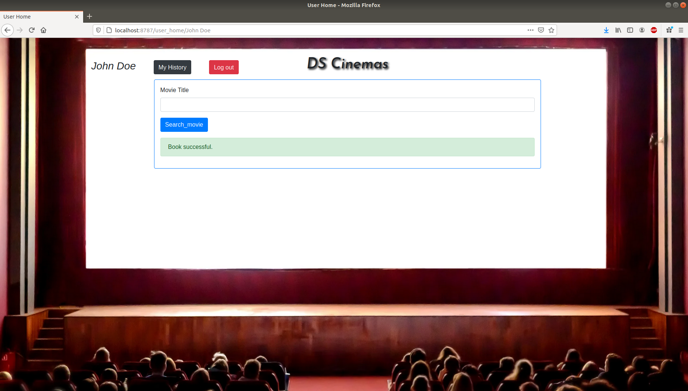</img>
      <h4>User History</h4>
      <h5>User can see what movies they have booked tickets for.</h5>
      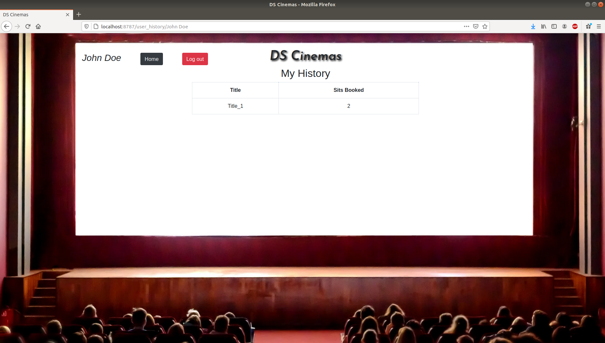</img>
    </li>
    <li>
      <h3>Admin Home page</h3>
      <h4>Functions: Insert,Update,Delete Movie & Add new Admin User</h4>
      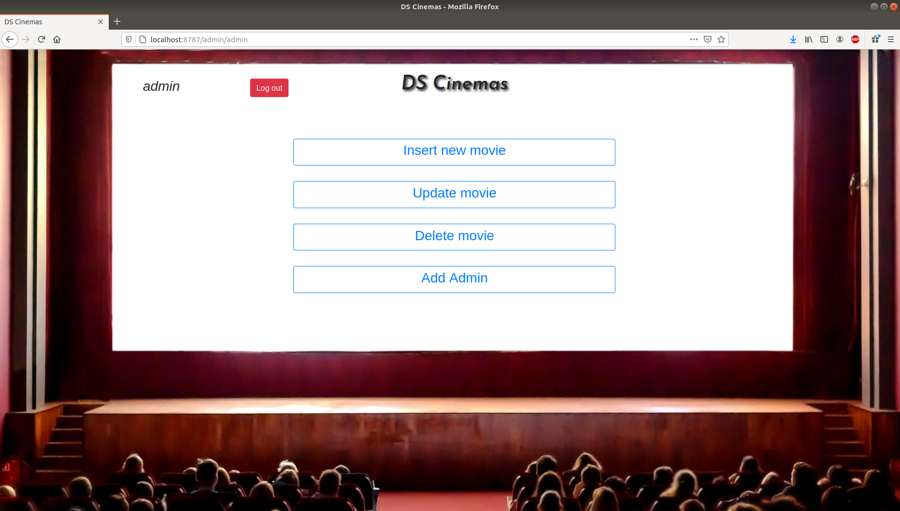</img>
      <h4>Insert Movie</h4>
      <h5>Admin types in Title,Release Date,Description and Screening Dates for the Movie they wish to insert to the database.</h5>
      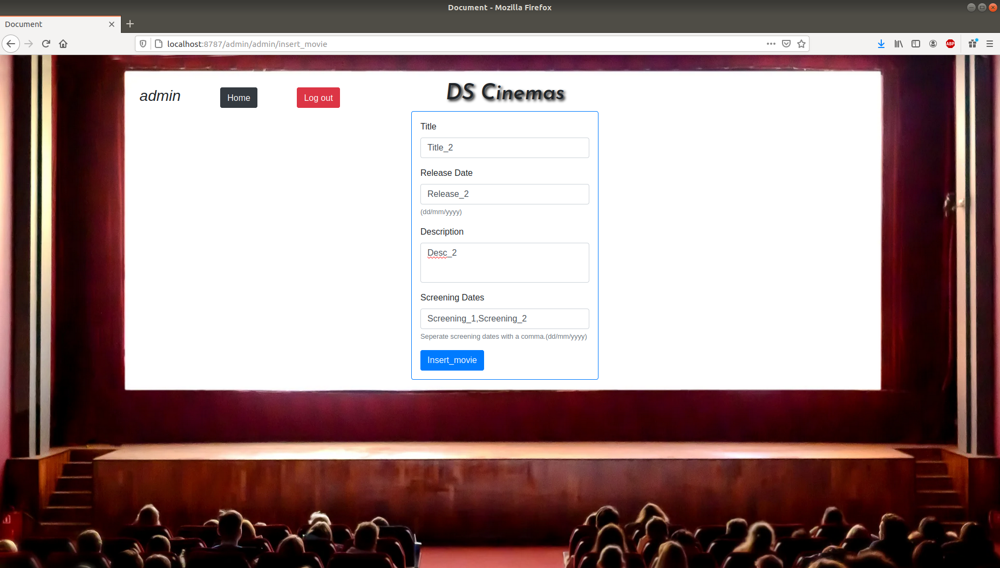</img>
      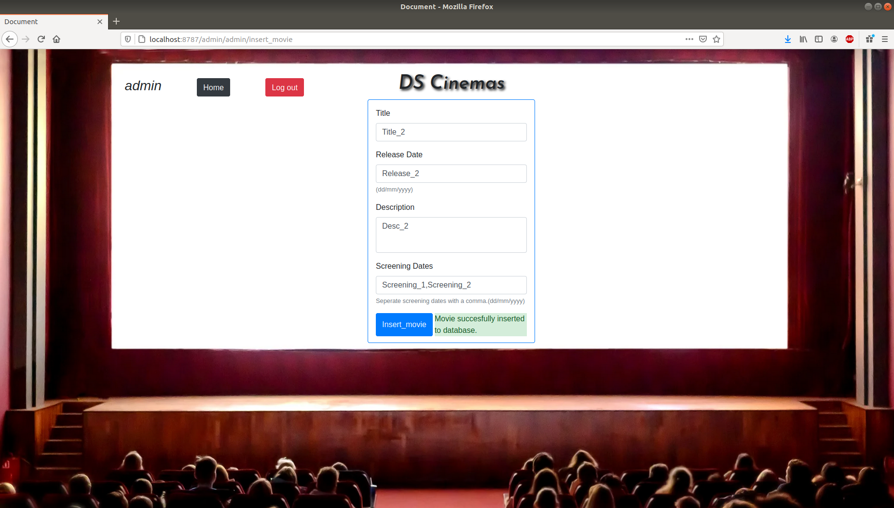</img>
      <h4>Update Movie</h4>   
      <h5>Admin finds and updates Movies info.</h5>
      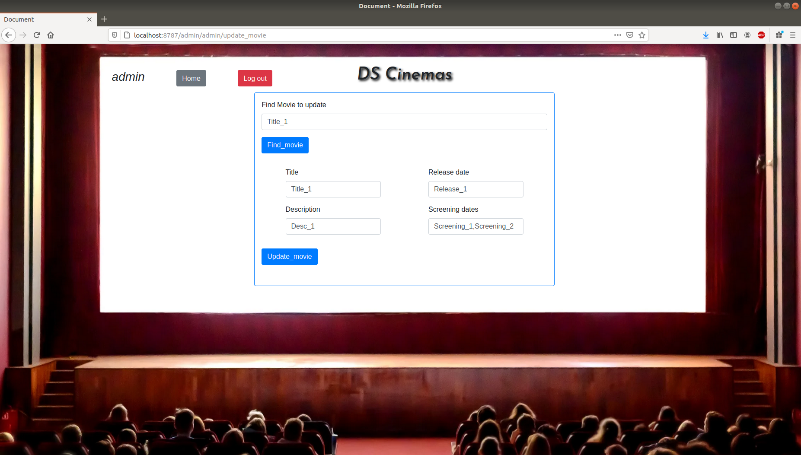</img>
      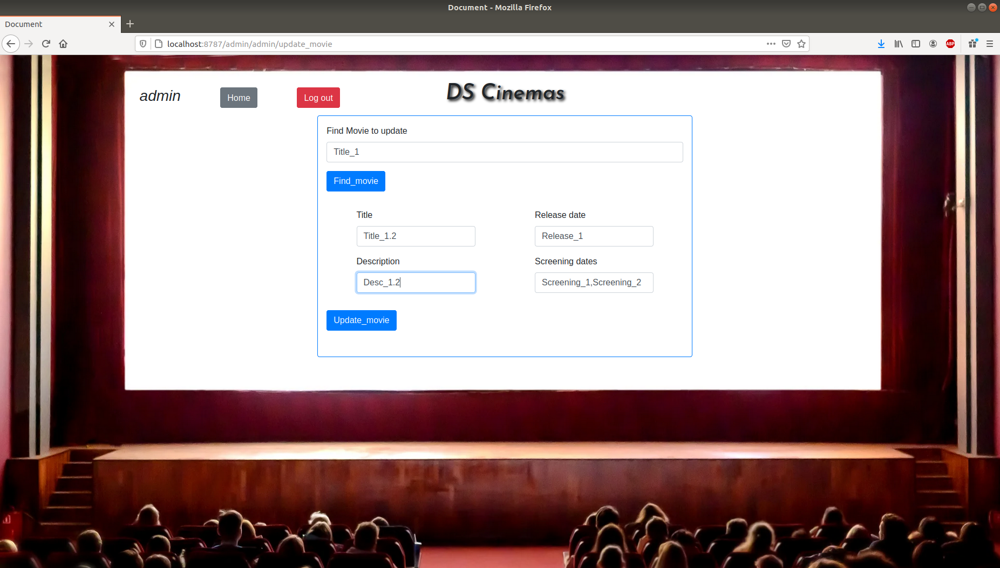</img>
      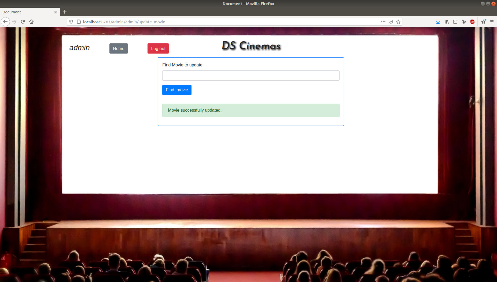</img>
      <h4>Delete Movie</h4>   
      <h5>Admin finds and deletes Movie form database.</h5>
      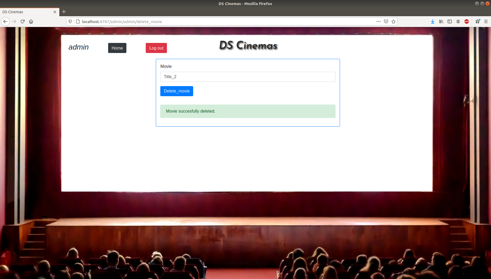</img>
      <h4>Delete Movie (Fail)</h4>
      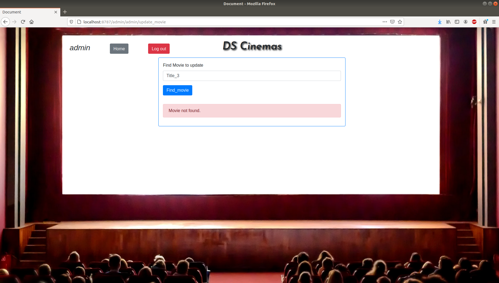</img>
      <h4>Add new Admin</h4>
      <h5>Admin adds credentials of new system admin.</h5>
      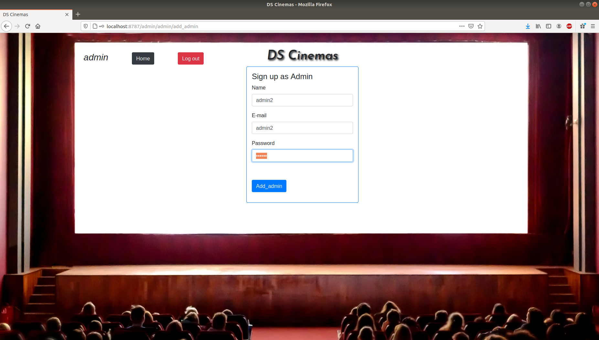</img>
      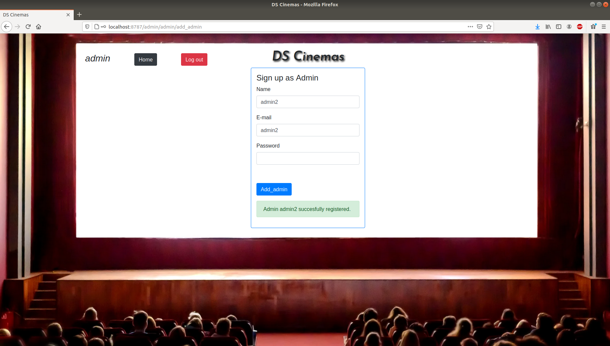</img>
      <h4>Add new Admin (Fail)</h4>
      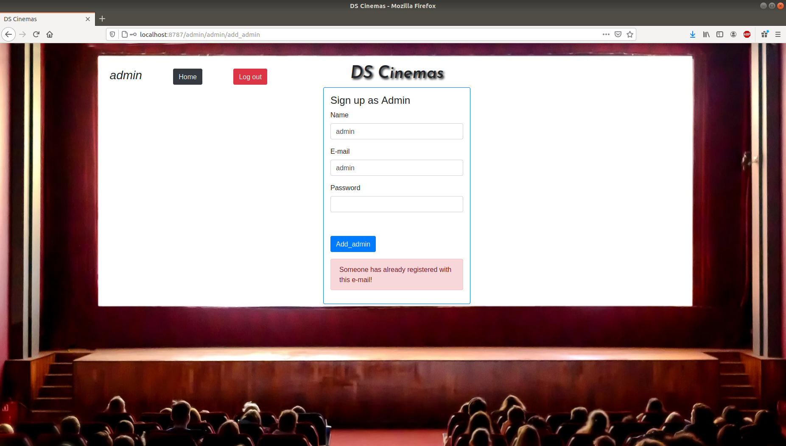</img>
    </li>
</ul>
