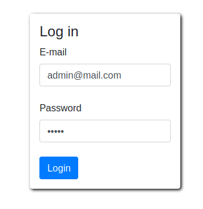

# InfoCinemas2020_E17015_Anthoulis_Panagiotis

### Εγκατάσταση
<ol>
  <li>Open up Terminal and run the following commands:<ul><li> git clone https://github.com/PanagiotisAnthoulis/InfoCinemas2020_E17015_Anthoulis_Panagiotis.git</li>
  <li>
  (sudo) docker-compose up
  </li>
</ul>
  </li>
  
  <li>Open up your web browser and type in the search bar: "localhost:8787"</li>
</ol>
<h3> Functions per page</h3>
<ul>
  <li>
     <h3>Home page</h3>
      Funtcions: Sign up,Log in
      </img> 
      <h4>User Sign up</h4>
      </img>
      <h4>User Sign up (In case there is already a user with this e-mail)</h4>
      </img>
    </li>
    <li>
      <h3>User Home page</h3>
      Functions: Movie search,Book tickets
      </img>
      <h4>Movie search</h4>
      </img>
      <h4>Ticket Book</h4>
      </img>
      <h3>
      <h4>Submit Order</h4>
      </img>
      <h4>Book Succesful</h4>
      </img>
      <h4>User History</h4>
      </img>
    </li>
    <li>
      <h3>Admin Home page</h3>
      <h4>Functions: Insert,Update,Delete Movie & Add new Admin User</h4>
      </img>
      <h4>Admin Log in</h4>
      </img>
      <h4>Insert Movie</h4>   
      </img>
      </img>
      <h4>Update Movie</h4>   
      </img>
      </img>
      </img>
      <h4>Delete Movie</h4>   
      </img>
      <h4>Delete Movie (Fail)</h4>
      </img>
      <h4>Add new Admin</h4>   
      </img>
      </img>
      <h4>Add new Admin (Fail)</h4>
      </img>
    </li>
    <h3></h3>
    <h3></h3>
    <h3></h3>
    <h3></h3>
    <h3></h3>
</ul>
